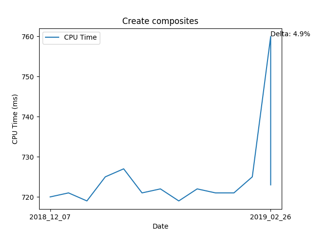
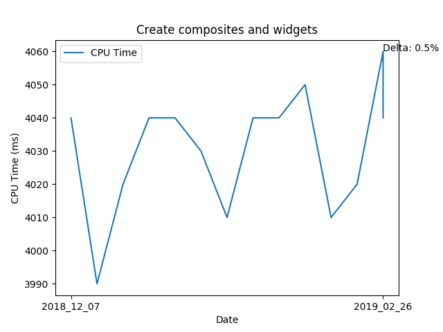
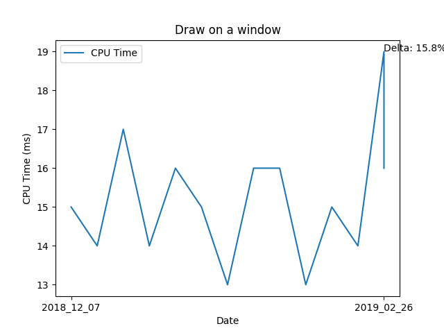
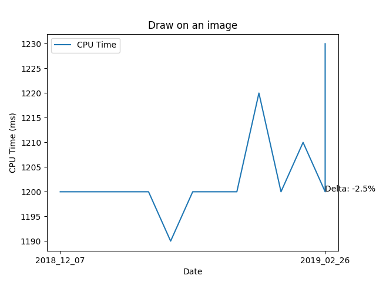

# SWT-Performance
SWT local performance tests logs, updated daily at 07:00 (EDT)

## CPU Time




.png)


## Compare Performance
```
# Results saved to result/compare/2018_10_30.txt
python3 generate_graph.py --base  2018_09_06__07_00_01.log --current 2018_10_30__07_00_01.log --metric "CPU Time"
```
